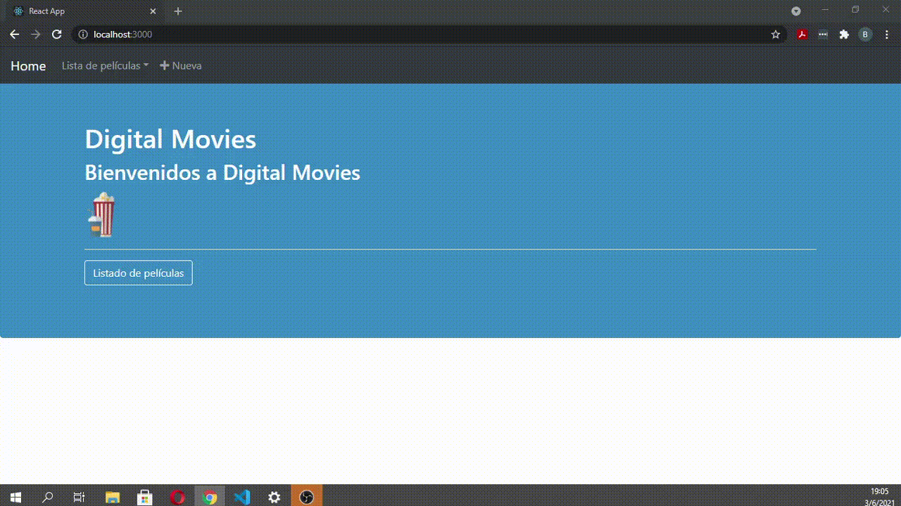

# Movies-Front-End
## Parcial de Metodología en Sistemas UTN 2021

> Este front-end consume los end point del proyecto: [Movies Back End](https://github.com/brunotarditi/Movies-Back-End).
>
> Se puede: 
* listar
* guardar 
* actualizar
* eliminar
>
> Base de datos 🐬 mysql 

### Recursos utilizados:
1. Iconos de: [Fontawesome](https://fontawesome.com). 
2. Animaciones de: [Animate.css](https://animate.style).
3. Estilos de: [React-Bootstrap](https://react-bootstrap.github.io).  